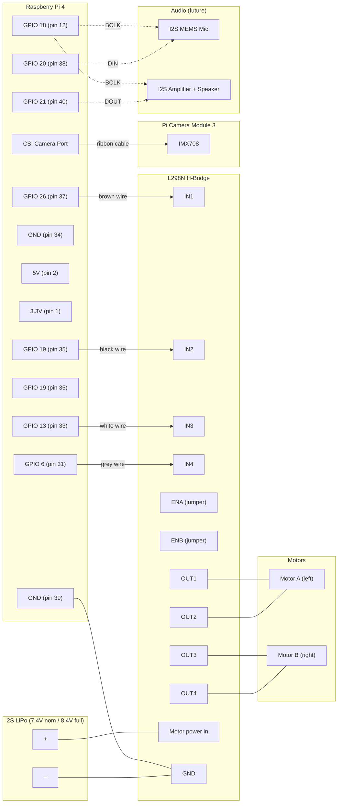

# Hardware Pinout

## Wiring Diagram



## Full GPIO Header

The 40-pin header as seen from above with the Pi oriented USB ports facing down. Left column is odd pins (1, 3, 5...), right column is even pins (2, 4, 6...).

```
                        +-----+
               3.3V  1  | o o |  2   5V
     (SDA1) GPIO  2  3  | o o |  4   5V
     (SCL1) GPIO  3  5  | o o |  6   GND
            GPIO  4  7  | o o |  8   GPIO 14 (TXD)
               GND  9   | o o |  10  GPIO 15 (RXD)
            GPIO 17  11  | o o |  12  GPIO 18 (PCM_CLK)  ◁── future I2S BCLK
            GPIO 27  13  | o o |  14  GND
            GPIO 22  15  | o o |  16  GPIO 23
               3.3V  17  | o o |  18  GPIO 24
   (MOSI) GPIO 10  19  | o o |  20  GND
   (MISO) GPIO  9  21  | o o |  22  GPIO 25
   (SCLK) GPIO 11  23  | o o |  24  GPIO  8 (CE0)
               GND  25  | o o |  26  GPIO  7 (CE1)
    (ID_SD) GPIO  0  27  | o o |  28  GPIO  1 (ID_SC)
            GPIO  5  29  | o o |  30  GND
    ■ IN4   GPIO  6  31  | o ● |  32  GPIO 12
    ■ IN3  GPIO 13  33  | ● o |  34  GND
    ■ IN2  GPIO 19  35  | ● o |  36  GPIO 16
    ■ IN1  GPIO 26  37  | ● o |  38  GPIO 20 (PCM_DIN)  ◁── future I2S mic data
               GND  39  | ● o |  40  GPIO 21 (PCM_DOUT) ◁── future I2S speaker data
                        +-----+

    ● = currently used       ■ = motor wire label
    ◁ = planned (future)
```

## Pin Allocation

### Currently Used — L298N H-Bridge

| Wire  | GPIO (BCM) | Board Pin | L298N | Motor       |
|-------|------------|-----------|-------|-------------|
| brown | 26         | 37        | IN1   | A (left) +  |
| black | 19         | 35        | IN2   | A (left) -  |
| white | 13         | 33        | IN3   | B (right) + |
| grey  | 6          | 31        | IN4   | B (right) - |
| —     | GND        | 39        | GND   | common ground |

### Planned — I2S Audio (microphone + speaker)

| GPIO (BCM) | Board Pin | I2S Function | Module          |
|------------|-----------|--------------|-----------------|
| 18         | 12        | PCM_CLK      | BCLK (shared)   |
| 19         | 35        | PCM_FS       | LRCLK (shared)  |
| 20         | 38        | PCM_DIN      | mic data in     |
| 21         | 40        | PCM_DOUT     | speaker data out|

> **Conflict**: GPIO 19 (pin 35) is used by both IN2 (motor A reverse) and I2S LRCLK.
> Before adding audio, motor IN2 must be rewired to a free GPIO (e.g. GPIO 16 pin 36 or GPIO 12 pin 32).

### Available GPIOs (no current or planned use)

| GPIO (BCM) | Board Pin | Notes                    |
|------------|-----------|--------------------------|
| 2          | 3         | I2C SDA (has pull-up)    |
| 3          | 5         | I2C SCL (has pull-up)    |
| 4          | 7         | general purpose          |
| 5          | 29        | general purpose          |
| 7          | 26        | SPI CE1                  |
| 8          | 24        | SPI CE0                  |
| 9          | 21        | SPI MISO                 |
| 10         | 19        | SPI MOSI                 |
| 11         | 23        | SPI SCLK                 |
| 12         | 32        | PWM0 — good for ENA      |
| 14         | 8         | UART TX                  |
| 15         | 10        | UART RX                  |
| 16         | 36        | general purpose          |
| 17         | 11        | general purpose          |
| 22         | 15        | general purpose          |
| 23         | 16        | general purpose          |
| 24         | 18        | general purpose          |
| 25         | 22        | general purpose          |
| 27         | 13        | general purpose          |

## Motor Logic (digital, no PWM)

| IN1 | IN2 | Motor A     |
|-----|-----|-------------|
| H   | L   | Forward     |
| L   | H   | Backward    |
| L   | L   | Stop (coast)|

Same pattern for IN3/IN4 controlling Motor B.

## Power

- **Battery**: 2S LiPo (7.4V nominal, 8.4V fully charged)
- **L298N motor supply**: fed directly from 2S battery
- **L298N 5V regulator**: active (can supply Pi via 5V pin if needed, but currently Pi is powered separately)
- **Pi power**: USB-C (separate supply or from L298N 5V out)

## Notes

- ENA/ENB jumpers left in place (full speed). Remove jumpers and connect to GPIO 12/GPIO 13 for PWM speed control — but GPIO 13 is currently IN3, so rewiring is needed first.
- Pi and L298N must share a common GND.
- Camera connects via CSI ribbon cable to the Pi camera port.
- GPIO 19 conflict must be resolved before I2S audio is added.
