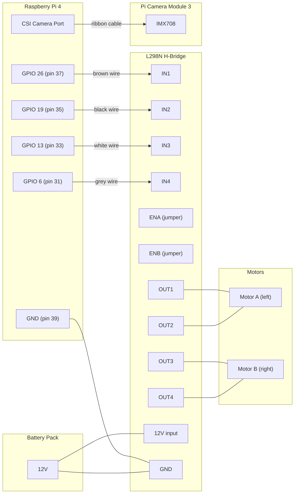

# Hardware Pinout

## Wiring Diagram

## Pin Table

| Wire  | GPIO (BCM) | Board Pin | L298N | Motor       |
|-------|------------|-----------|-------|-------------|
| brown | 26         | 37        | IN1   | A (left) +  |
| black | 19         | 35        | IN2   | A (left) -  |
| white | 13         | 33        | IN3   | B (right) + |
| grey  | 6          | 31        | IN4   | B (right) - |
| -     | GND        | 39        | GND   | common ground |

## Motor Logic (digital, no PWM)

| IN1 | IN2 | Motor A     |
|-----|-----|-------------|
| H   | L   | Forward     |
| L   | H   | Backward    |
| L   | L   | Stop (coast)|

Same pattern for IN3/IN4 controlling Motor B.

## Notes

- ENA/ENB jumpers left in place (full speed). Remove jumpers and connect to Pi PWM pins for speed control later.
- Pi and L298N must share a common GND.
- L298N powered by 12V battery pack, not from Pi.
- Camera connects via CSI ribbon cable to the Pi camera port.
